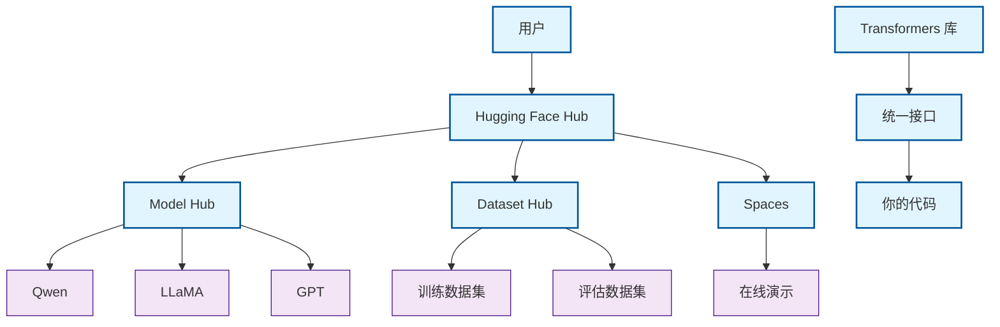

# snake
请提供一个C语言源代码，在ubuntu上可以编译运行一个贪吃蛇游戏
gcc snake.c -o snake.exe -lncurses
./snake.exe

# 模型训练计划
一、前期准备（Win11环境配置）
1. 安装基础工具
(1) Python 环境

    推荐 Python 3.10（兼容性最好）

    下载地址：Python 官网

    安装时勾选 "Add Python to PATH"（方便命令行调用）

    验证安装：
    bash

    python --version
    pip --version

(2) CUDA & cuDNN（GPU加速）

    RTX 3060 12GB 支持 CUDA 11.8 或 CUDA 12.x

    安装步骤：

        下载 NVIDIA CUDA Toolkit（推荐 CUDA 11.8）
        → CUDA Toolkit 11.8

        安装时选择 自定义安装，确保勾选 CUDA Development Tools

        下载 cuDNN（需注册 NVIDIA 账号）
        → cuDNN 8.6.0 for CUDA 11.x

        解压 cuDNN，复制 bin、include、lib 到 C:\Program Files\NVIDIA GPU Computing Toolkit\CUDA\v11.8

        验证安装：
        bash

        nvcc --version  # 应显示 CUDA 11.8
        nvidia-smi      # 检查 GPU 是否识别

(3) Git（代码管理）

    下载地址：Git for Windows

    安装后验证：
    bash

    git --version

2. 安装深度学习框架
(1) PyTorch（推荐）

    运行以下命令安装 PyTorch + CUDA 11.8：
    bash

pip install torch torchvision torchaudio --index-url https://download.pytorch.org/whl/cu118

验证 GPU 是否可用：
python

    import torch
    print(torch.cuda.is_available())  # 应返回 True
    print(torch.cuda.get_device_name(0))  # 应显示 "RTX 3060"

(2) Hugging Face Transformers（大模型必备）
bash

pip install transformers datasets accelerate bitsandbytes peft

(3) 其他实用工具
bash

pip install jupyterlab langchain sentencepiece tiktoken

二、本地运行大模型（适合 RTX 3060 12GB）
1. 运行量化模型（4bit/8bit）
(1) 使用 text-generation-webui（可视化界面）

    适合 7B/13B 量化模型（ChatGLM3、Qwen1.5、Mistral）

    安装：
    bash

git clone https://github.com/oobabooga/text-generation-webui
cd text-generation-webui
pip install -r requirements.txt

下载 4bit 量化模型（如 Qwen1.5-7B-Chat-GPTQ）：
bash

python download-model.py Qwen/Qwen1.5-7B-Chat-GPTQ

启动：
bash

    python server.py --model Qwen1.5-7B-Chat-GPTQ --listen --auto-devices

    访问 http://localhost:7860 进行交互

(2) 使用 Ollama（命令行运行）

    适合 快速测试 Llama3、Mistral 等

    安装：
    bash

curl -fsSL https://ollama.com/install.sh | sh

运行 7B 量化模型：
bash

    ollama pull mistral:7b-instruct-q4_0
    ollama run mistral:7b-instruct-q4_0

三、推荐学习教程（适合 Win11 + RTX 3060）
1. 入门级（零基础）
教程	链接	特点
微软 AI 大模型通识课（中文）	GitHub	零基础入门，涵盖 LLM 基础、API 使用
Happy-LLM（Datawhale）	GitHub	系统性学习，适合中文用户
B 站：大模型课程 L1-1	Bilibili	暨南大学课程，理论+实践
2. 实战级（微调/部署）
教程	链接	特点
LLM-Universe（Datawhale）	GitHub	从零构建知识库助手
Ollama 微调指南	Collabnix	本地微调 Llama3/Mistral
LangChain 实战	LangChain Crash Course	构建 AI Agent
四、后续学习路径

    基础掌握后 → 学习 LoRA/QLoRA 微调（适合 7B 模型）

    进阶 → 尝试 RAG（检索增强生成），如 LangChain + FAISS

    生产级 → 学习 Docker 部署，如 FastAPI + vLLM

总结

✅ 已完成：

    安装 Python + CUDA + PyTorch

    配置 Hugging Face 环境

    运行本地 7B 量化模型（Qwen/Mistral）

📚 推荐学习：

    新手 → 微软 AI 大模型通识课

    实战 → LLM-Universe

    微调 → Ollama 微调指南

你的 RTX 3060 12GB 完全可以胜任 7B 模型的推理和轻量微调，按这个路线逐步深入即可！

# 术语解释
## 预训练模型（Pre-trained Model）
预训练模型是指 在海量数据上预先训练好的神经网络，它已经学会了：

    语言规律（语法、语义、上下文）

    世界知识（事实、概念、推理）

    多任务能力（翻译、总结、创作等）
常见类型
类型	代表模型	特点	你的使用场景
大语言模型	Qwen、LLaMA、GPT	文本生成、对话	你现在运行的Qwen1.5-7B
多模态模型	LLaVA、CLIP	理解图像+文本	图片描述、视觉问答
语音模型	Whisper	语音转文字	会议录音转文字
编码模型	CodeLlama	代码生成	Python代码辅助

为什么这是革命性的？

    民主化AI：普通人也能用上最先进的AI

    零样本学习：无需训练就能处理新任务

    通用性：同一个模型处理多种任务
总结来说，预训练模型让你能够直接使用现成的"AI大脑"，而不需要从零开始培养一个AI。你的RTX 3060+PyTorch组合正是运行这类模型的完美配置！

对预训练模型，PyTorch已经足够。
PyTorch提供了：

    模型加载接口：
    python

from transformers import AutoModelForCausalLM
model = AutoModelForCausalLM.from_pretrained("Qwen/Qwen1.5-7B-Chat")

推理功能：
python

    output = model.generate(input_ids)  # 直接生成文本

    优化加速：

        CUDA加速（GPU）

        量化（4bit/8bit）

        注意力优化（FlashAttention）

你不需要：

    重新训练模型（需要大量计算资源）

    编写底层GPU代码（PyTorch已封装）

    处理分布式训练（单卡推理足够）
## PyTorch - 提供框架 - 在最底层
AI 世界的乐高积木——它提供了各种标准化模块和工具，让开发者能快速搭建和训练神经网络，而无需从零开始造轮子
PyTorch 是一个：

    🎯 深度学习框架：提供神经网络构建和训练的基础设施

    ⚡ GPU 加速引擎：让你的 RTX 3060 发挥最大效能

    🧩 生态集成中心：连接 Hugging Face、ONNX 等工具

    🚀 生产力工具：让 AI 开发从"手工作坊"变为"现代化工厂"
### PyTorch 的三大核心功能
1. 张量计算（Tensor Computing）
python

import torch

创建张量（多维数组）
x = torch.tensor([[1, 2], [3, 4]])  类似 numpy array
y = torch.tensor([[5, 6], [7, 8]])

GPU 加速（你的 RTX 3060 发挥作用）
if torch.cuda.is_available():
    x = x.cuda()  # 转移到 GPU
    y = y.cuda()

高效数学运算
z = x + y          # 张量加法
w = torch.matmul(x, y)  # 矩阵乘法

2. 自动微分（Automatic Differentiation）
python

定义计算过程
x = torch.tensor(2.0, requires_grad=True)
y = x ** 2 + 3 * x + 1

自动计算梯度（机器学习的关键）
y.backward()       # 反向传播
print(x.grad)      # 输出：7.0 (dy/dx = 2x +3，x=2时值为7)

3. 神经网络构建（Neural Network Building）
python

import torch.nn as nn

定义神经网络（像搭积木）
model = nn.Sequential(
    nn.Linear(100, 50),    # 全连接层
    nn.ReLU(),             # 激活函数
    nn.Linear(50, 10),     # 输出层
    nn.Softmax(dim=1)      # 概率归一化
)

前向传播
output = model(input_data)


### 为什么选择 PyTorch（而不是 TensorFlow 等）

    Pythonic 设计：像写 Python 一样自然

    动态计算图：调试更简单，灵活性更高

    强大的生态系统：Hugging Face、TorchVision 等

    业界主流：Meta、OpenAI 等公司广泛使用

### 与其他技术的对比
特性	PyTorch	TensorFlow	JAX
易用性	⭐⭐⭐⭐⭐（最友好）	⭐⭐⭐（较复杂）	⭐⭐（学习曲线陡峭）
部署能力	⭐⭐⭐⭐	⭐⭐⭐⭐⭐（最强）	⭐⭐⭐⭐
生态系统	⭐⭐⭐⭐⭐（Hugging Face）	⭐⭐⭐⭐	⭐⭐⭐（较新）
你的适用性	✅ 完美匹配	❌ 过度复杂	❌ 研究向


生态系统对比
特性	TensorFlow	PyTorch	你的选择建议
设计理念	生产导向，静态图	研究导向，动态图	研究选PyTorch，部署选TF
部署能力	⭐⭐⭐⭐⭐（强）	⭐⭐⭐⭐（强）	两者都很好
社区支持	工业界主导	学术界主导	看你所在领域
学习曲线	较陡峭	较平缓	新手推荐PyTorch
你的使用场景	❌ 过度复杂	✅ 完美匹配	用PyTorch即可

岗位类型	主要任务	框架要求	你的风险
研究/算法岗	模型创新、实验、调优	PyTorch 是绝对主流	几乎为零
工程/部署岗	模型部署、上线、服务化、优化	TensorFlow 仍有相当比例	有一定风险

市场现状分析 (2024-2025)
1. 研究与算法开发 (你的主要方向)

    现状：PyTorch 已成为 学术界和工业界研发的绝对主导。Hugging Face、各大公司（Meta, OpenAI等）的最新模型都首选 PyTorch 实现和发布。

    招聘要求：你看国内大厂（阿里、腾讯、字节）和AI初创公司的JD，基本都要求“熟练掌握PyTorch”，TensorFlow 常常是“加分会”、“有更好”，而不是必需。

    结论：应聘这些岗位，只精通 PyTorch 完全没有技能缺陷，甚至是首选。

2. 工程与部署 (你需要关注的领域)

    现状：TensorFlow 在传统企业、移动端、嵌入式部署（TFLite）和大规模服务化（TF Serving） 方面仍有深厚积累。很多老项目和历史包袱重的公司（尤其是一些传统业务转型AI的公司）仍在用 TF。

    招聘要求：如果你面的是 机器学习平台岗、模型部署岗、端侧AI岗，那么要求 TensorFlow 的概率会高很多。

    结论：如果你的目标是这类岗位，不会 TensorFlow 是一个明显的技能缺口。

### 代码例子
import torch  #这就是你的"万能钥匙"

1. 模型加载（依赖 torch 的序列化功能）
from transformers import AutoModelForCausalLM
model = AutoModelForCausalLM.from_pretrained(
    "./Qwen1.5-7B-Chat",
    torch_dtype=torch.float16,  # 使用 torch 的数据类型
    device_map="auto"           # 使用 torch 的设备管理
)

2. 数据转换（文本 → 张量）
input_ids = tokenizer.encode("你好", return_tensors="pt")  # pt = PyTorch Tensor

3. GPU 推理（ torch 调用 CUDA）
with torch.no_grad():           # 禁用梯度计算（推理模式）
    output = model.generate(input_ids.to(model.device))

## Hugging Face - 提供与训练模型，供调优和运行 - 基于框架在中间，是拥有大量模型的github库
AI 模型的「GitHub」 + 「App Store」——它是一个集模型托管、分享、下载和运行于一体的平台，专门为机器学习社区服务。
一、核心功能比喻
传统概念	Hugging Face 的对应	你的受益
GitHub（代码托管）	🤗 Model Hub（模型托管）	免费下载千余个预训练模型
Docker Hub（镜像仓库）	🤗 Dataset Hub（数据集托管）	获取高质量训练数据
npm/pip（包管理）	🤗 Transformers 库（模型标准化接口）	统一方式调用不同模型
App Store（应用商店）	🤗 Spaces（在线演示）	直接体验模型效果

与其他平台的对比
平台	专注领域	特点	类似产品
Hugging Face	深度学习模型	开源社区驱动	GitHub + Docker Hub
OpenAI API	商业API服务	闭源但易用	AWS/Azure 云服务
TensorFlow Hub	TensorFlow 模型	谷歌生态绑定	苹果 App Store
PyTorch Hub	PyTorch 模型	Meta 主导	更技术向



商业模式

    免费层：模型托管、下载、基础推理

    付费服务：GPU 加速推理、企业版、私有部署

    开源核心：Transformers、Datasets 等库完全开源
    
### Model Hub（模型仓库）
就像 GitHub，但托管的是模型权重而非代码
from transformers import AutoModelForCausalLM

从 Hugging Face Hub 加载模型（类似 git clone）
model = AutoModelForCausalLM.from_pretrained(
    "Qwen/Qwen1.5-7B-Chat"  # 类似 GitHub 的 username/repo
)

也可以加载其他热门模型：
- "meta-llama/Llama-3-8B-Instruct"
- "microsoft/Phi-3-mini"
- "google/gemma-7b"

git clone https://huggingface.co/Qwen/Qwen1.5-7B-Chat
cd Qwen1.5-7B-Chat

#文件结构类似代码仓库：
#- config.json        #模型配置
#- model.safetensors  #模型权重（相当于代码）
#- tokenizer.json     #分词器配置
#- README.md          #说明文档
版本控制
python

#加载特定版本的模型
model = AutoModel.from_pretrained(
    "Qwen/Qwen1.5-7B-Chat",
    revision="v1.0"  #指定版本号
)

1. 模型下载与管理
python
from huggingface_hub import snapshot_download

#下载模型到本地
snapshot_download(
    repo_id="Qwen/Qwen1.5-7B-Chat",
    local_dir="./qwen-model",
    ignore_patterns=["*.bin"],  #跳过不必要的文件
    local_dir_use_symlinks=False
)

2. 探索和发现模型
from huggingface_hub import HfApi

api = HfApi()
models = api.list_models(
    filter="text-generation",  #筛选条件
    sort="downloads",         #按下载量排序
    limit=10
)

for model in models:
    print(f"{model.modelId} - {model.downloads}次下载")


### transformer
Hugging Face 的神经网络库
包含的功能：
- 自然语言处理（NLP）模型
- 计算机视觉（CV）模型  
- 语音处理模型
- 多模态模型

#### 核心功能详解
##### AutoModelForCausalLM
1. 自动模型识别

from transformers import AutoModelForCausalLM

#自动检测模型类型并加载合适的架构
model = AutoModelForCausalLM.from_pretrained("Qwen/Qwen1.5-7B-Chat")

相当于帮你自动选择了正确的模型类：
if "Qwen" in model_name:
    return QwenForCausalLM(...)
elif "GPT" in model_name:
    return GPT2LMHeadModel(...)
else:
    return ...

2. 预训练权重加载
python

#从 Hugging Face Hub 下载训练好的权重
model = AutoModelForCausalLM.from_pretrained(
    "./Qwen1.5-7B-Chat",  #模型路径（在线或本地）
    local_files_only=True  #如果已下载，避免重复下载
)

3. 配置管理
python

自动处理模型配置
model.config  包含所有模型参数：
{
  "vocab_size": 151936,     词表大小
  "hidden_size": 4096,      隐藏层维度
  "num_attention_heads": 32, 注意力头数
  "num_hidden_layers": 32   Transformer层数
}

与其他组件的对比
方法	优点	缺点	适用场景
AutoModelForCausalLM	自动识别架构，简单易用	略有性能开销	推荐：大多数应用
QwenForCausalLM	直接调用，性能最优	需要知道具体架构	专业部署
AutoModel	更通用，支持任何任务	需要手动指定任务	多任务学习

##### AutoTokenizer
自动加载对应的分词器
tokenizer = AutoTokenizer.from_pretrained("./Qwen1.5-7B-Chat")

##### BitsAndBytesConfig
支持多种量化方式
from transformers import BitsAndBytesConfig

4bit量化配置
quantization_config = BitsAndBytesConfig(
    load_in_4bit=True,
    bnb_4bit_compute_dtype=torch.float16
)

自动应用量化
model = AutoModelForCausalLM.from_pretrained(
    "./Qwen1.5-7B-Chat",
    quantization_config=quantization_config  #自动处理量化逻辑
)

##### 生成文本输出
#使用加载的模型进行文本生成
inputs = tokenizer("你好，请介绍一下你自己", return_tensors="pt").to(model.device)

with torch.no_grad():
    outputs = model.generate(
        **inputs,
        max_new_tokens=100,
        do_sample=True,
        temperature=0.7
    )

#解码输出
result = tokenizer.decode(outputs[0], skip_special_tokens=True)

### Datasets（数据集中心）
python

from datasets import load_dataset

#加载数据集（类似 Model Hub）
dataset = load_dataset("glue", "mrpc")  #微软释义数据集
print(dataset['train'][0])  #查看第一条数据

#热门数据集：
#- "wikitext"（维基百科文本）
#- "squad"（问答数据集）
#- "imdb"（情感分析）

### Spaces（在线演示）

    功能：直接在浏览器中体验模型效果

    示例：Qwen 在线演示 https://huggingface.co/spaces/Qwen/Qwen1.5-7B-Chat 

    你的使用：测试模型效果后再决定下载

## nvidia-cuda-toolkit
sudo apt install nvidia-cuda-toolkit
 NVIDIA 官方提供的 CUDA 开发工具包，它包含了在 GPU 上进行通用计算所需的完整工具链
组件	作用	是否必须
NVCC 编译器	将 CUDA C/C++ 代码编译为 GPU 可执行文件	✅ 开发必需
CUDA 运行时库	libcudart.so - 提供 GPU 计算的基础 API（如内存管理、核函数启动）	✅ 运行必需
CUDA 驱动库	与 GPU 驱动程序通信的低层接口	✅ 运行必需
数学库	cuBLAS（线性代数）、cuFFT（傅里叶变换）、cuRAND（随机数生成）等	🟡 可选
性能分析工具	nvprof、nsight - 用于优化 GPU 代码性能	🟡 可选
调试工具	cuda-gdb - GPU 代码调试器	🟡 可选
二、什么情况下需要安装？
✅ 需要安装的场景：

    编译 GPU 程序（如从源码编译 llama.cpp）
    bash

    cd llama.cpp && make LLAMA_CUDA=1  # 需要 NVCC 编译器

    开发 CUDA 应用（自己写 GPU 加速代码）

    使用需要 CUDA 编译的库（如某些科学计算库）

❌ 不需要安装的场景：

    仅运行预编译的 PyTorch/TensorFlow（它们自带 CUDA 运行时）

    只使用 transformers 库推理（PyTorch 已包含必要组件）

    纯 Python 开发（除非用到需要编译的 CUDA 扩展）
可能冲突

    如果已通过 pip 安装 PyTorch，可能已有部分 CUDA 组件
磁盘空间

    完整 Toolkit 约占用 3-5GB 空间

    如果只需要运行时，可只安装基础包：
    bash

sudo apt install cuda-runtime-12-2

## Hugging Face、Llama.cpp、Ollama、LangChain
它们的关系总结：
组件	角色	目的	使用者
Hugging Face	模型和工具的源头	创造、分享、获取模型	研究者、开发者
Llama.cpp	高效的推理工具	在普通设备上低成本运行模型	极客、追求性能的开发者
Ollama	模型运行时	让用户最简单地上手运行模型	最终用户、初学者
LangChain	应用组装框架	构建复杂的、多步骤的AI应用	应用开发者

如何选择？

    你只想和AI聊天？ -> 用 Ollama，最简单。

    你想在自己的老Mac上跑模型？ -> 研究 Llama.cpp，性能最好。

    你想深入研究AI，自己训练或微调模型？ -> 上 Hugging Face。

    你想开发一个“公司知识库问答机器人”这种复杂应用？ -> 用 LangChain 来编排所有步骤。

这样说明白了吗？它们不是四个并列的选择，而是不同层面的工具，可以根据你的需求组合使用。


    如果你想省心省力，快速在本地和模型对话，或者为自己的应用快速集成一个模型后端，选择 Ollama。

    如果你需要极致的控制、极致的性能或在极端环境下运行，或者你想深入研究推理和量化技术，那么你应该直接使用 Llama.cpp。

很多时候，它们不是二选一的关系。很多开发者会使用 Ollama 来快速原型和测试，而当需要部署到生产环境时，则使用 Llama.cpp 进行深度优化。

### ollama - 最上层， 用户终端工具
Ollama 是一个开源的大型语言模型（LLM）服务工具，它能让用户在本地计算机上轻松下载、运行和管理各种大语言模型。你可以把它理解为一个“本地版的模型应用商店”，通过简单的命令，就能在你自己电脑上体验和探索 AI 大模型。
功能类别	具体说明	常用命令示例
模型运行与管理	拉取、运行、列出、删除模型	ollama run llama3
, ollama list, ollama rm
模型交互	提供命令行聊天界面和 API 接口（默认端口 11434
），方便与模型对话或集成到其他应用	curl http://localhost:11434/api/generate

Ollama 的出现，大大降低了个人开发者、研究人员乃至爱好者本地体验和实验大语言模型的门槛。如果你希望在本地快速尝试各种开源大模型，同时又关注数据隐私，那么 Ollama 是一个非常值得尝试的工具。

####  如何使用 Ollama

使用 Ollama 非常简单，基本流程如下：

    下载安装：访问 Ollama 官网 (https://ollama.com) 下载并安装适用于你操作系统（Windows、macOS、Linux）的版本

。

拉取模型：安装完成后，你就可以通过命令行拉取并运行模型。例如，想体验 Meta 的 Llama 3 模型，只需在终端输入：
bash

ollama run llama3

如果本地没有该模型，Ollama 会自动从官网拉取

。

与模型交互：模型运行后，会进入一个交互式界面，你可以直接输入问题或指令与模型对话

。

使用 API：Ollama 也提供 REST API 接口（默认位于 http://localhost:11434），方便开发者将自己的应用程序与本地模型集成
。
#### 丰富的生态工具

如果你觉得命令行界面不够直观，Ollama 还有一个丰富的生态，有许多第三方开发的图形界面（WebUI）工具，例如 Ollama WebUI、Lobe Chat 等，可以提供类似 ChatGPT 的聊天体验

## 各层次总结与类比
组件	角色	类比
PyTorch/TensorFlow	基础框架	发动机、底盘、钢材 (提供最基础的制造能力)
Hugging Face	模型生态与库	汽车设计图、零部件供应商、汽车超市 (提供标准化的零件和设计)
Ollama	应用与部署工具	一家成品汽车经销商** (提供即买即开的整车，免去你组装的烦恼)

如何选择？

    如果你想从零开始研究、训练、修改模型，你需要直接使用 PyTorch/TensorFlow 和 Hugging Face Transformers 库（写代码）。

    如果你只是想快速地下载并在本地运行最新模型，与它聊天或集成到你的应用中，那么 Ollama 是更简单直接的选择。

    绝大多数开发者和研究者会同时使用它们：用Hugging Face的模型和库进行开发与实验，然后用Ollama这样的工具将满意的模型成果方便地部署和分享出去。

# WSL2平台训练计划
配置：R54600G, 16GX2 DDR4, 256G NVME, 3060 12G, 长城电源额定750W, 可追加机械硬盘1T或SSD 512G, 目前win11，如需要可改装linux
辅助学习配置笔记本（在另一个时间段可以使用）：13th Gen Intel(R) Core(TM) i5-1340P (1.90 GHz)， 16G RAM, 200G空闲磁盘NVME

以下是针对你的需求优化的 Win11 + WSL2 大模型学习计划，结合性能限制分析及对应解决方案，帮助你在WSL2环境下高效学习：
一、WSL2 的优势与适用场景
1. 优势

    接近原生Linux体验：支持大多数Linux工具链（如Bash、Docker）26

    GPU加速支持：可通过CUDA on WSL调用NVIDIA显卡（RTX 3060 12GB可用）47

    开发便利性：

        直接在Windows文件系统（如/mnt/c/）访问数据

        无缝使用VS Code远程开发（Remote-WSL扩展）

2. 适用场景

    轻量级训练/推理（7B以下量化模型）

    快速实验原型开发

    学习Linux环境但不装双系统

二、WSL2 的限制与解决方案
1. 性能损失（对比纯Linux）
问题	影响	解决方案
I/O 速度较慢	数据集加载延迟（尤其小文件）	将数据放在WSL2内部文件系统（如~/data），而非Windows挂载盘（/mnt/c/）4
GPU穿透开销	训练速度比纯Linux慢5-15%	使用--gpus all确保GPU直通，并关闭Windows后台进程（如Defender）7
CUDA库兼容性问题	部分库（如cuDNN）需手动配置路径	在~/.bashrc添加：export LD_LIBRARY_PATH=/usr/lib/wsl/lib:$LD_LIBRARY_PATH5
内存管理不足	大模型可能触发OOM（如13B+）	限制WSL2内存：在%USERPROFILE%\.wslconfig设置memory=12GB（留余量给Windows）9
2. 功能限制
问题	替代方案
无法直接使用NVIDIA工具（如nsight）	通过Windows原生工具（如NVIDIA-SMI）监控GPU状态
多GPU训练支持差	仅单GPU可用，分布式训练需纯Linux或云服务器
Docker性能较低	使用nvidia-docker而非Windows Docker Desktop
三、优化后的 WSL2 学习计划
阶段1：环境配置（1天）

    启用WSL2并安装Ubuntu 22.04
    powershell

wsl --install -d Ubuntu-22.04
wsl --set-version Ubuntu-22.04 2

配置CUDA on WSL

    安装Windows版NVIDIA驱动（官网下载）

    在WSL2内安装CUDA Toolkit：
    bash

    sudo apt install nvidia-cuda-toolkit
    nvidia-smi  # 验证GPU识别

优化WSL2设置
创建%USERPROFILE%\.wslconfig：
ini

    [wsl2]
    memory=12GB  # 限制内存，避免OOM
    processors=6  # 分配6核（R5 5500X3D共6核）

阶段2：模型运行（3-5天）
推荐工具
工具	用途	优化技巧
text-generation-webui	本地对话模型（7B/13B量化）	使用--auto-devices --gpu-memory 10限制显存占用15
Ollama	快速运行Llama3/Mistral	ollama pull mistral:7b-instruct-q4_0（4bit量化版）
vLLM	高性能推理引擎	仅限Linux原生，WSL2性能损失约10%4
关键命令示例
bash

#在WSL2中运行量化模型（示例：Qwen1.5-7B）
python -m transformers.run_generation \
    --model Qwen/Qwen1.5-7B-Chat \
    --load-in-4bit \
    --device cuda \
    --trust-remote-code

阶段3：轻量微调（5-7天）
适用技术

    LoRA/QLoRA（显存占用<10GB）
    python

    from peft import LoraConfig
    config = LoraConfig(r=8, target_modules=["q_proj", "v_proj"])  # 低秩适配

    数据集优化

        预处理数据放在WSL2内部（~/datasets）加速读取

        使用datasets库流式加载（避免全量加载）

避坑指南

    避免使用Model.fit()（可能卡死），改用自定义训练循环1

    监控显存：
    bash

    watch -n 1 nvidia-smi  # 实时查看GPU使用

四、何时应切换回纯Windows？
建议纯Windows的场景

    使用Windows专属工具（如Unity ML-Agents）

    调试GUI应用（如PyQt5可视化）

    运行ONNX/DirectML加速的模型（如Stable Diffusion）

建议纯Linux的场景

    大规模训练（13B+全参数微调）

    多GPU/分布式训练

    生产环境部署

五、学习资源推荐（WSL2适配版）

    微软官方WSL2+CUDA指南：链接

    Hugging Face课程（WSL2兼容）：链接

    WSL2性能优化技巧：CSDN博客10

总结

✅ WSL2适合你当前需求（7B模型学习+轻量微调），但需注意：

    I/O性能需优化（数据放WSL2内部）

    GPU穿透有轻微损耗（约5-15%）

    内存需手动限制（防OOM）

若后续进阶到大规模训练，建议过渡到Ubuntu物理机/云服务器。


# WSL2 AI环境搭建指南 - 1 day then ask what are these terms used.

## 硬件配置
- **笔记本**：13th Gen Intel i5-1340P, 16GB RAM, 200GB NVME (核显)
- **台式机**：R5 4600G, 32GB DDR4, RTX 3060 12GB, 256GB NVME + 可扩展存储

## 第一阶段：WSL2安装与配置

### 步骤1：安装WSL2
```powershell
# 检查WSL状态
wsl --list --verbose

步骤1：以管理员身份打开PowerShell

    按下 Win + X，选择 终端(管理员) 或 Windows PowerShell(管理员)

    确保不是普通CMD（必须管理员权限）
# 1. 启用WSL功能（如果之前没做过）
dism.exe /online /enable-feature /featurename:Microsoft-Windows-Subsystem-Linux /all /norestart

# 2. 启用虚拟机平台（关键步骤！）
dism.exe /online /enable-feature /featurename:VirtualMachinePlatform /all /norestart

# 3. 设置WSL2为默认版本
wsl --set-default-version 2
# 重启系统（必须）
# 重启后继续下一步

方法1：通过微软商店安装（推荐）

    打开 Microsoft Store（微软商店）

    搜索 "Ubuntu 22.04 LTS"

    点击 "获取" → "安装"
方法2：
    wsl --install -d Ubuntu-22.04
```

### 步骤2：Ubuntu初始设置
```bash
首次启动Ubuntu

    在 开始菜单 找到并点击 Ubuntu 22.04
    （首次启动会显示控制台窗口，等待解压完成）

    设置 用户名 和 密码：

        用户名建议全英文（如llmuser）www/www

        密码输入时不会显示字符，正常输入后回车确认
        （密码用于sudo操作，建议简单易记如123456）

# 更新系统
sudo apt update && sudo apt upgrade -y

# 安装基础工具
sudo apt install -y wget curl git vim htop
sudo apt install -y make g++ git
sudo apt install -y cmake build-essential git python3-pip

文件互访：
win: \\wsl.localhost\
linux: cd /mnt/c/
```

cursor/vscode win11远程访问wsl2：
搜索并安装以下两个核心插件：

    Remote - WSL（微软官方开发，必装）

    WSL（Cursor 增强支持，可选但推荐）
左下角可以点击然后选择wsl来链接

阶段1：环境配置
所有设备通用步骤：

    打开 Cursor → 确保左下角显示 WSL: Ubuntu-22.04

    在 Cursor 的 WSL 终端中执行：
    bash

sudo apt update
sudo apt install -y python3-venv git
mkdir -p ~/llm_env && cd ~/llm_env
python3 -m venv venv
source venv/bin/activate
    pip install --upgrade pip
    pip install wheel setuptools

### 步骤3 python3环境
阶段2：安装依赖
笔记本（无显卡）：
bash

#安装CPU专用库
pip install torch torchvision torchaudio --index-url https://download.pytorch.org/whl/cpu
pip install transformers sentencepiece accelerate

家里台式机（RTX 3060）：
bash
1. **检查并安装 Python3**
    ```bash
    python3 --version
    # 如果未安装，执行：
    sudo apt update
    sudo apt install -y python3 python3-pip python3-venv
    ```

2. **创建项目目录和虚拟环境**
    ```bash
    mkdir -p ~/llm_env
    cd ~/llm_env
    python3 -m venv venv
    source venv/bin/activate
    ```

3. **升级 pip 和安装常用工具**
    ```bash
    pip install --upgrade pip
    pip install wheel setuptools
    ```

4. **安装 PyTorch（GPU版，CUDA 11.8）**
    ```bash
    pip install torch torchvision torchaudio --index-url https://download.pytorch.org/whl/cu118
    ```

5. **安装 Hugging Face 及相关依赖**
    ```bash
    pip install transformers accelerate bitsandbytes sentencepiece
    ```

6. **验证 GPU 是否可用**
    ```bash
    python -c "import torch; print(torch.cuda.is_available())"
    # 输出 True 表示 GPU 可用
    ```

7. **安装其他常用工具（可选）**
    ```bash
    pip install jupyterlab htop git-lfs
    ```

8. **环境激活说明**
    - 每次新开终端时，进入项目目录并激活环境：
      ```bash
      cd ~/llm_env
      source venv/bin/activate
      ```

9. **后续步骤提示**
    - 完成上述步骤后，可继续下载模型、进行推理或微调实验。

### 模型推理实验
阶段1：下载模型
#1. 安装 Git LFS
sudo apt-get update
sudo apt-get install -y git-lfs
git lfs install
sudo apt install nvidia-cuda-toolkit

笔记本（无显卡） → 选择 TinyLlama-1.1B（4bit量化）：
bash

cd ~/llm_env
git lfs install
git clone https://huggingface.co/TheBloke/TinyLlama-1.1B-Chat-v1.0-GGUF #如果下载不了，用下面的：
git clone https://hf-mirror.com/TheBloke/TinyLlama-1.1B-Chat-v1.0-GGUF
wget https://hf-mirror.com/TheBloke/TinyLlama-1.1B-Chat-v1.0-GGUF/resolve/main/tinyllama-1.1b-chat-v1.0.Q4_K_M.gguf #这个最快

家里台式机（RTX 3060） → 选择 Qwen1.5-7B（4bit量化）：
bash

cd ~/llm_env
git lfs install
git clone https://huggingface.co/Qwen/Qwen1.5-7B-Chat-GPTQ


阶段2：准备运行环境 和 启动推理
步骤1：进入模型目录
bash

cd TinyLlama-1.1B-Chat-v1.0-GGUF

步骤2：安装必要工具
sudo apt-get update && sudo apt-get install -y libopenblas-dev
sudo apt-get install pkg-config
如果是 CPU 环境（笔记本无显卡）：
bash

#安装 llama.cpp（优化CPU推理）
source venv/bin/activate
git clone https://github.com/ggerganov/llama.cpp
cd llama.cpp
make -j4  # 编译（-j4表示用4个CPU核心加速）


cd ~/llm_env/llama.cpp
rm -rf build
#禁用CURL功能（如果不需要从网络直接加载模型）
cmake -B build -DCMAKE_BUILD_TYPE=Release -DLLAMA_CURL=OFF -DGGML_BLAS=ON -DGGML_BLAS_VENDOR=OpenBLAS
#确保安装CURL后重新配置
#cmake .. -DLLAMA_CURL=ON
cmake --build build --config Release -j $(nproc)
ls -lh bin/main 


如果是 GPU 环境（家里台式机 RTX 3060）：
bash

pip install transformers accelerate sentencepiece  # 已安装可跳过

步骤3：运行模型
CPU 版（笔记本）：
bash

#回到模型目录
cd ~/llm_env/TinyLlama-1.1B-Chat-v1.0-GGUF
如果是wget的:
./bin/main -m ../tinyllama-1.1b-chat-v1.0.Q4_K_M.gguf -p "你好"

#使用 llama.cpp 运行（示例指令）
../llama.cpp/main -m tinyllama-1.1b-chat-v1.0.Q4_K_M.gguf \
  -p "你好，请介绍一下你自己" \
  -n 128  # 生成128个token

cd /home/www/llm_env
./llama.cpp/build/bin/llama-cli -m tinyllama-1.1b-chat-v1.0.Q4_K_M.gguf
what is 1+1?

GPU 版（台式机）：
python

#在Cursor中新建Python文件（如run.py）
from transformers import AutoModelForCausalLM, AutoTokenizer

model = AutoModelForCausalLM.from_pretrained(
    "./TinyLlama-1.1B-Chat-v1.0-GGUF",
    device_map="auto"
)
tokenizer = AutoTokenizer.from_pretrained("./TinyLlama-1.1B-Chat-v1.0-GGUF")

inputs = tokenizer("你好，请介绍一下你自己", return_tensors="pt").to("cuda")
outputs = model.generate(**inputs, max_new_tokens=128)
print(tokenizer.decode(outputs[0]))

步骤4：验证输出

    预期结果：模型会生成类似以下的回复：
    text

你好！我是一个TinyLlama-1.1B人工智能助手，擅长回答一般性问题...

#### GPU环境
https://modelscope.cn/models/Qwen/Qwen1.5-7B-Chat-GPTQ-Int4
https://gitee.com/hf-models/Qwen1.5-7B-Chat 

#### 阶段1：下载模型
1. 安装 Git LFS 和 CUDA Toolkit（如未安装可跳过）
    ```bash
    sudo apt-get update
    sudo apt-get install -y git-lfs
    git lfs install
    sudo apt install nvidia-cuda-toolkit
    ```

2. 下载 Qwen1.5-7B 量化模型
cd ~/llm_env
git clone https://huggingface.co/Qwen/Qwen1.5-7B-Chat-GPTQ-Int4
git clone https://gitee.com/hf-models/Qwen1.5-7B-Chat.git

#### 阶段2：准备运行环境
1. 进入模型目录
    ```bash
    cd ~/llm_env/Qwen1.5-7B-Chat-GPTQ-Int4
    ```

2. 安装依赖（如 transformers、accelerate 已安装可跳过）
    ```bash
    pip install transformers accelerate bitsandbytes sentencepiece
    ```
#### 阶段3：运行推理代码
1. 新建 Python 文件（如 run_qwen.py），写入以下内容：
```
from transformers import AutoModelForCausalLM, AutoTokenizer
device = "cuda" # the device to load the model onto

model = AutoModelForCausalLM.from_pretrained(
    "Qwen/Qwen1.5-7B-Chat",
    torch_dtype="auto",
    device_map="auto"
)
tokenizer = AutoTokenizer.from_pretrained("Qwen/Qwen1.5-7B-Chat")

prompt = "Give me a short introduction to large language model."
messages = [
    {"role": "system", "content": "You are a helpful assistant."},
    {"role": "user", "content": prompt}
]
text = tokenizer.apply_chat_template(
    messages,
    tokenize=False,
    add_generation_prompt=True
)
model_inputs = tokenizer([text], return_tensors="pt").to(device)

generated_ids = model.generate(
    model_inputs.input_ids,
    max_new_tokens=512
)
generated_ids = [
    output_ids[len(input_ids):] for input_ids, output_ids in zip(model_inputs.input_ids, generated_ids)
]

response = tokenizer.batch_decode(generated_ids, skip_special_tokens=True)[0]
```
    ```python
    from transformers import AutoModelForCausalLM, AutoTokenizer

    model = AutoModelForCausalLM.from_pretrained(
        "./Qwen1.5-7B-Chat-GPTQ-Int4",
        device_map="auto"
    )
    tokenizer = AutoTokenizer.from_pretrained("./Qwen1.5-7B-Chat-GPTQ-Int4")

    inputs = tokenizer("你好，请介绍一下你自己", return_tensors="pt").to("cuda")
    outputs = model.generate(**inputs, max_new_tokens=128)
    print(tokenizer.decode(outputs[0]))
    ```

2. 运行推理脚本
    ```bash
    python run_qwen.py
    ```
#### 阶段4：验证输出
- 预期模型会生成类似以下的回复：
    ```
    你好！我是Qwen1.5-7B人工智能助手，擅长回答一般性问题...
    ```

---